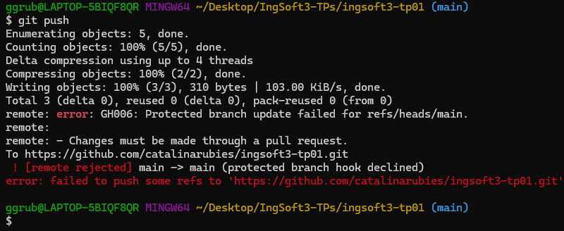
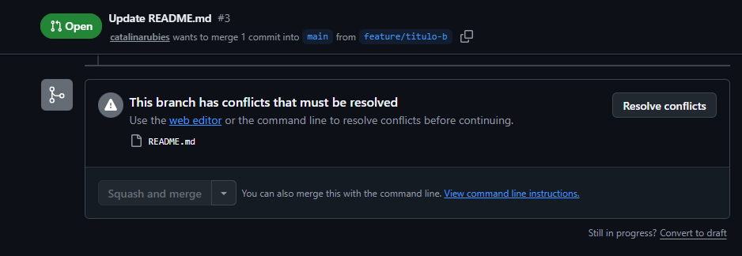
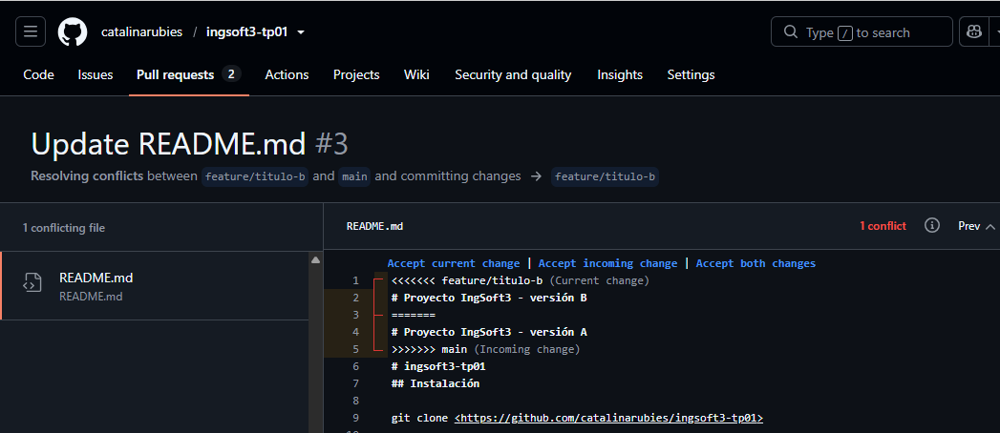
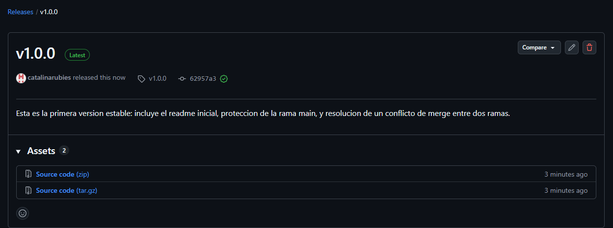

# Evidencias

## TP1 - Control de versiones

### 1. Push directo a main rechazado

GitHub rechaza el push directo a `main` porque la rama esta protegida y la regla "Do not allow bypassing" alcanza tambien al dueño del repositorio.

### 2. El PR de la rama B no se puede mergear: conflicto

Al intentar mergear el PR de `feature/titulo-b` despues de haber mergeado `feature/titulo-a`, GitHub avisa que no puede mergearlo automaticamente porque ambas ramas modificaron la misma linea del `README.md`.

### 3. Marcadores de conflicto sin resolver

El editor de resolucion de conflictos de GitHub muestra los marcadores `<<<<<<<`, `=======` y `>>>>>>>` delimitando la version de la rama `feature/titulo-b` y la version ya presente en `main`, antes de decidir que contenido queda.

### 4. Release v1.0.0 publicada

La release `v1.0.0`, creada a partir del tag anotado pusheado desde la terminal, publicada en la pagina del repositorio con su descripcion.