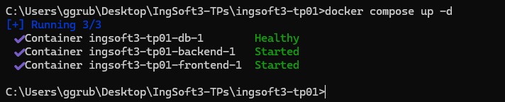
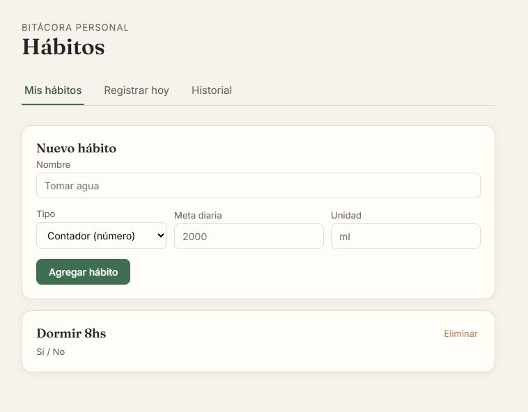
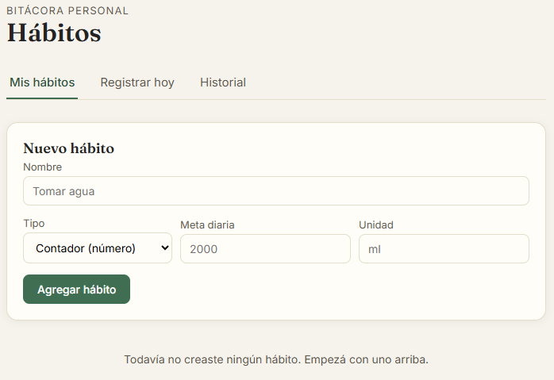
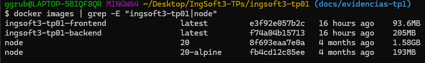
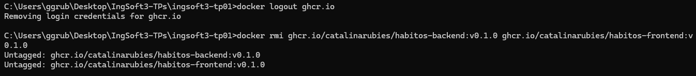
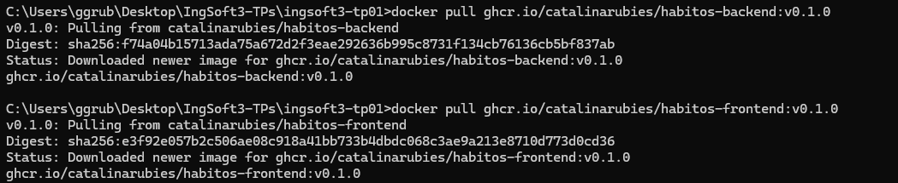

# Evidencias

## TP1 - Control de versiones

### 1. Push directo a main rechazado

GitHub rechaza el push directo a `main` porque la rama esta protegida y la regla "Do not allow bypassing" alcanza tambien al dueño del repositorio.

### 2. El PR de la rama B no se puede mergear: conflicto

Al intentar mergear el PR de `feature/titulo-b` despues de haber mergeado `feature/titulo-a`, GitHub avisa que no puede mergearlo automaticamente porque ambas ramas modificaron la misma linea del `README.md`.

### 3. Marcadores de conflicto sin resolver

El editor de resolucion de conflictos de GitHub muestra los marcadores `<<<<<<<`, `=======` y `>>>>>>>` delimitando la version de la rama `feature/titulo-b` y la version ya presente en `main`, antes de decidir que contenido queda.

### 4. Release v1.0.0 publicada

La release `v1.0.0`, creada a partir del tag anotado pusheado desde la terminal, publicada en la pagina del repositorio con su descripcion.

## TP2 - Contenedores

### 1. Sistema levantado con `docker compose up -d` y funcionando end-to-end

Los tres servicios (`db`, `backend`, `frontend`) levantan con un solo comando: `db` queda `Healthy` (gracias al healthcheck) antes de que `backend` arranque.

El frontend, servido por nginx en el contenedor, muestra los datos que vienen del backend contenerizado, que a su vez los trae de la base MySQL contenerizada - confirma la comunicación entre los tres servicios.

### 2. Prueba de persistencia

Después de `docker compose down` (sin `-v`) y un nuevo `docker compose up -d`, el hábito cargado antes sigue apareciendo: el volumen `db_data` conservó los datos.

Después de `docker compose down -v`, el volumen se elimina junto con los contenedores: al levantar de nuevo, la app aparece completamente vacía.

### 3. Comparación de tamaño: imagen final vs. imagen del SDK

`ingsoft3-tp01-frontend` (93.6MB) pesa menos incluso que `node:20-alpine` sola (193MB), porque su etapa final usa `nginx:alpine` sin Node adentro. `ingsoft3-tp01-backend` (205MB) pesa 7.7 veces menos que `node:20` completo (1.58GB), gracias a partir de la base `alpine` desde el principio.

### 4. Imágenes publicadas en el registry

Antes de la prueba: cierre de sesión en `ghcr.io` (`docker logout`) y borrado de las imágenes locales (`docker rmi`), para simular a alguien que nunca tuvo acceso a mi cuenta.
 

`docker pull` de las dos imágenes (`ghcr.io/catalinarubies/habitos-backend:v0.1.0` y `habitos-frontend:v0.1.0`) funciona sin pedir credenciales, confirmando que quedaron públicas de verdad.